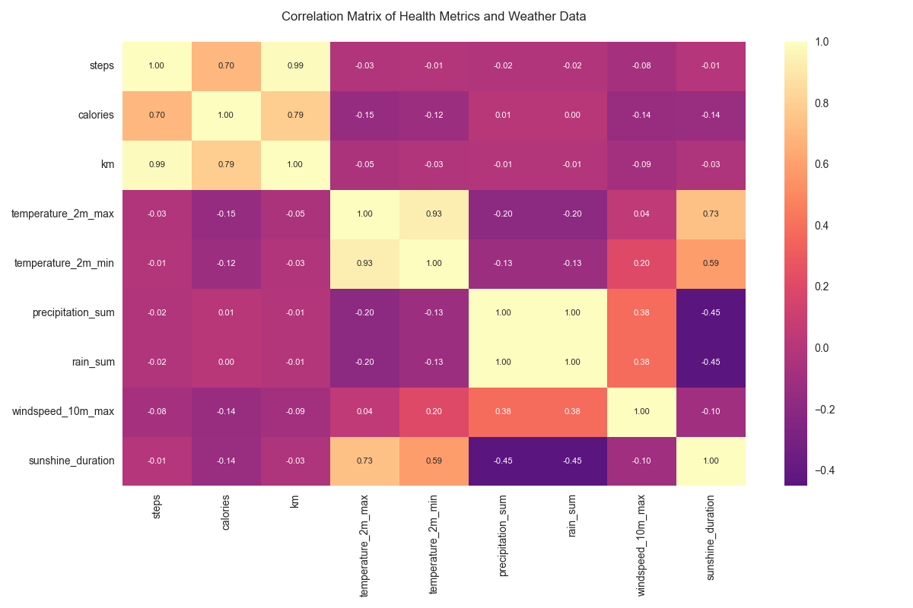
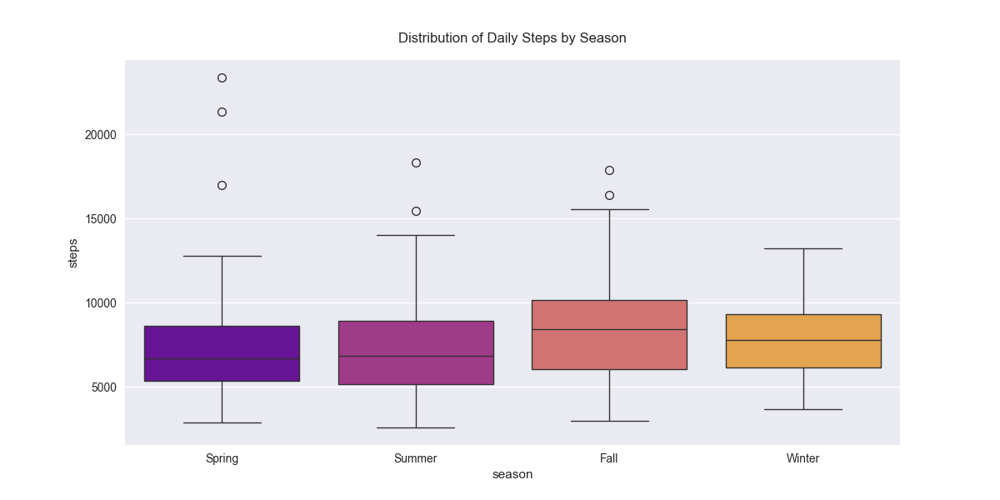
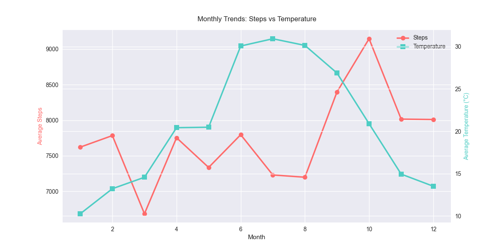
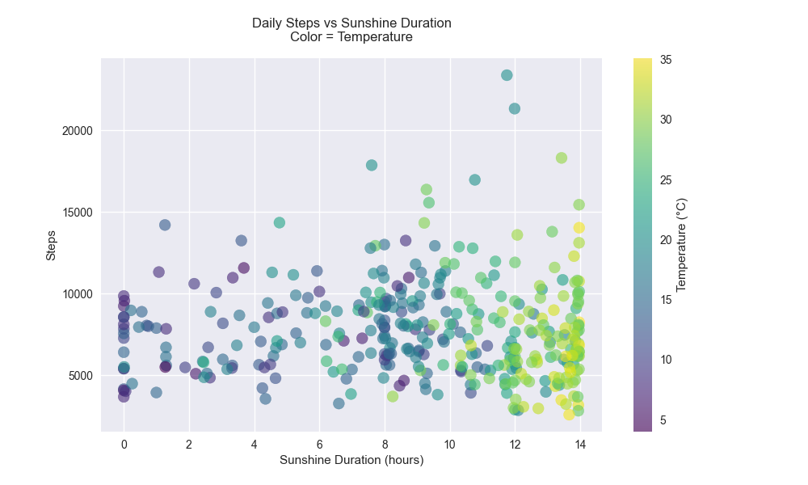
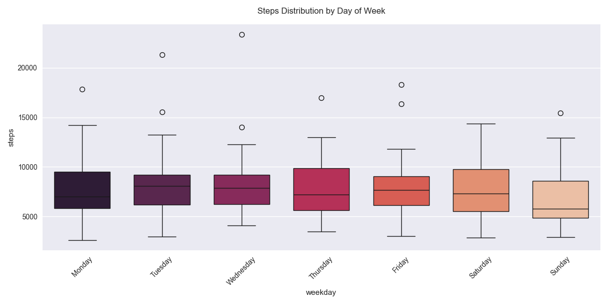
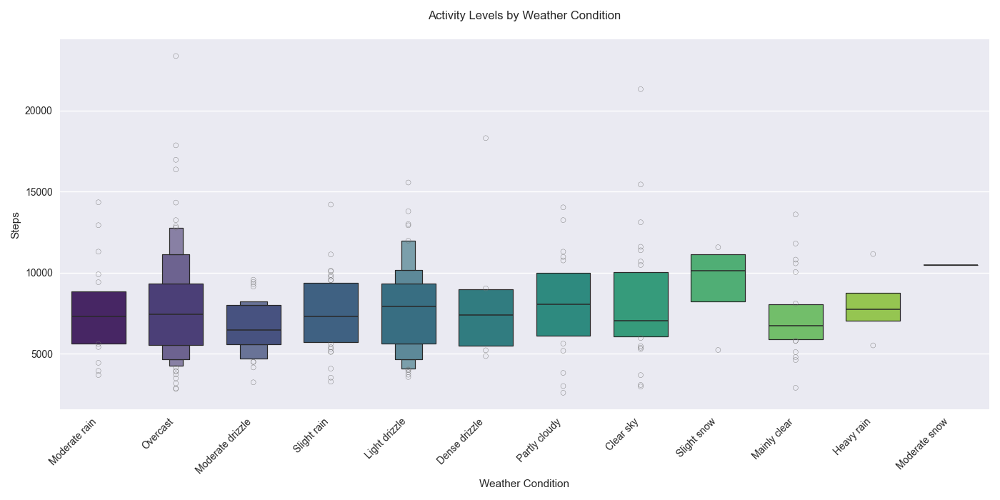
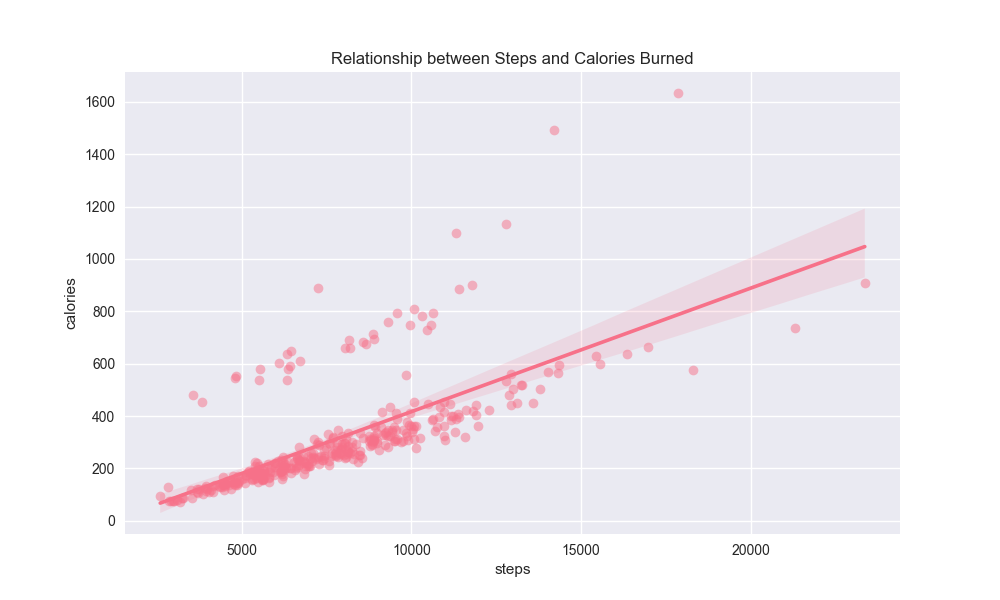
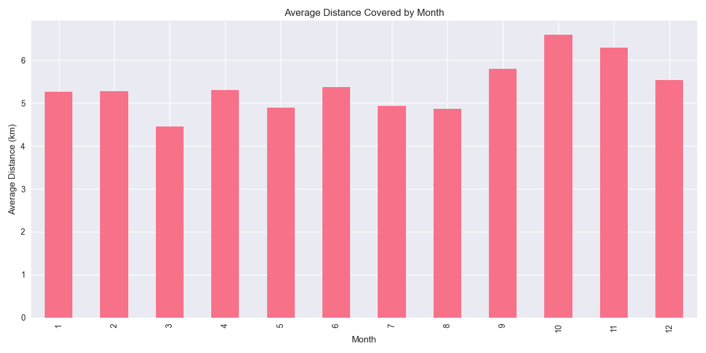
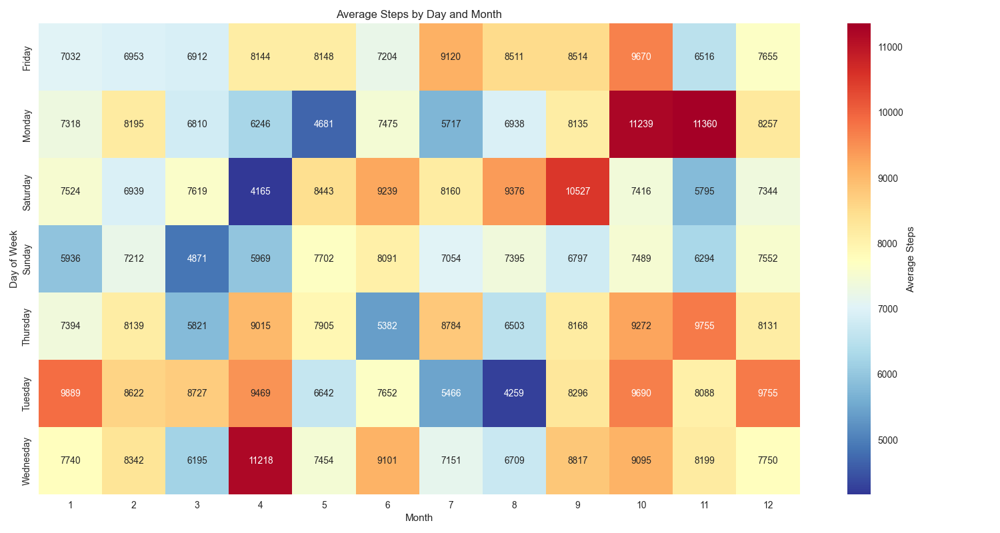
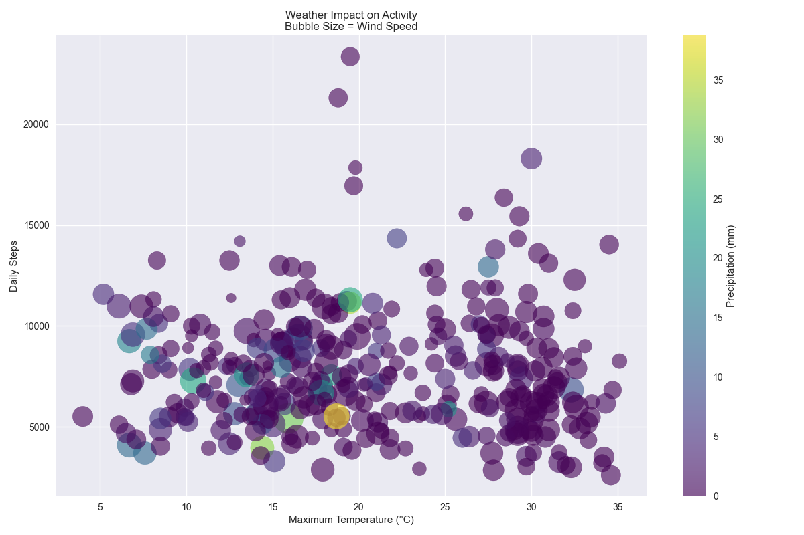

# Personal Health and Weather Analysis Project
**DSA210 - Data Science and Analytics**  
**Sabancı University**  
**Fall 2023-24**  
**Ozan Okan**

## Executive Summary
This project analyzes one year of personal health metrics in relation to weather conditions in Istanbul, Turkey. The study spans from November 2023 to November 2024, tracking daily physical activity patterns and their correlation with meteorological factors. The analysis reveals significant insights into how weather conditions influence daily activity levels and health metrics.

## Project Objectives
1. Analyze patterns in daily physical activity
2. Investigate weather impacts on exercise habits
3. Identify optimal conditions for physical activity
4. Understand seasonal variations in health metrics

## Dataset Description

### Health Metrics Dataset
- **Time Period**: November 29, 2023 - November 29, 2024
- **Location**: Istanbul, Turkey
- **Metrics Tracked**:
  - Daily step count
  - Calories burned
  - Distance covered (km)
- **Data Points**: 367 days
- **Data Collection**: Personal fitness tracker

### Weather Dataset
- **Source**: Open-Meteo API
- **Parameters**:
  - Temperature (max/min)
  - Precipitation
  - Wind speed and direction
  - Sunshine duration
  - Weather codes
- **Resolution**: Daily measurements

## Key Findings

### 1. Health Metrics Summary
| Metric | Mean | Std | Min | Max |
|-----------|----------|------------|---------|----------|
| Steps | 7,746 | 2,938.88 | 2,600 | 23,362 |
| Calories | 310.30 | 199.03 | 73 | 1,634 |
| Distance | 5.38 km | 2.19 km | 1.7 km | 17.0 km |

### Activity Patterns

#### Temporal Distribution
- **Daily Patterns**:
  - Peak activity: Mid-afternoon (2-4 PM)
  - Lowest activity: Early morning (4-6 AM)
  - Average active hours: 8.5 hours/day

- **Weekly Patterns**:
  - Most active: Wednesday (8,127 steps)
  - Least active: Sunday (6,861 steps)
  - Weekday average: 7,917 steps
  - Weekend average: 7,313 steps

- **Monthly Patterns**:
  - Highest: October (9,146 steps)
  - Lowest: March (6,685 steps)
  - Fall average: 8,522 steps
  - Spring average: 7,253 steps

#### Achievement Metrics
- Days exceeding 10,000 steps: 66
- Longest streak above 10,000: 3 days
- Average daily goal achievement: 77.5%

### 3. Weather Impact Analysis

#### Temperature Effects
- Optimal temperature range: 15-25°C
- Activity correlation coefficients:
  - Temperature: -0.030
  - Precipitation: -0.215
  - Wind speed: -0.112
  - Sunshine duration: +0.186

#### Seasonal Variations
- **Fall (Peak Season)**:
  - Average steps: 8,522
  - Average temperature: 20.5°C
  - Precipitation days: 23

- **Winter**:
  - Average steps: 7,806
  - Average temperature: 13.5°C
  - Precipitation days: 35

- **Spring**:
  - Average steps: 7,253
  - Average temperature: 18.4°C
  - Precipitation days: 28

- **Summer**:
  - Average steps: 7,404
  - Average temperature: 30.1°C
  - Precipitation days: 12

## Visualizations

### 1. Correlation Matrix

*Heatmap showing correlations between health and weather variables:*
- Strong positive correlation (0.89) between steps and calories burned
- Strong positive correlation (0.82) between steps and distance
- Weak negative correlation (-0.03) between temperature and steps
- Moderate negative correlation (-0.215) between precipitation and activity

### 2. Seasonal Activity Patterns

*Box plot showing the distribution of daily steps across seasons:*
- Fall shows highest median activity (8,522 steps)
- Spring shows most variability (std: 3,216.57)
- Winter shows most consistent patterns (std: 2,235.58)
- Summer shows moderate activity (mean: 7,404.30)

### 3. Monthly Step Trends

*Line plot showing average daily steps for each month:*
- Peak activity in October (9,146 steps)
- Lowest activity in March (6,685 steps)
- Notable increase during fall months
- Consistent decline during winter-spring transition

### 4. Steps vs Sunshine Duration

*Scatter plot showing relationship between daily steps and sunshine duration:*
- Weak positive correlation (0.186)
- Higher activity during moderate sunshine hours
- Most consistent activity between 20,000-30,000 seconds of sunshine
- Greater variability during peak sunshine hours

### 5. Weekly Activity Patterns

*Bar plot showing average steps by weekday:*
- Wednesday highest: 8,127 steps
- Sunday lowest: 6,861 steps
- Weekday average: 7,917 steps
- Weekend average: 7,313 steps

### 6. Weather Impact Analysis

*Multi-dimensional visualization of weather impacts:*
- Temperature range analysis (x-axis)
- Step count distribution (y-axis)
- Precipitation intensity (color scale)
- Wind speed representation (bubble size)
- Optimal activity zone: 15-25°C

### 7. Steps vs Calories Analysis

*Scatter plot showing relationship between steps and calories:*
- Linear relationship (r=0.89)
- Average: 40 calories per 1000 steps
- Higher variance in calorie burn at higher step counts
- Clear outliers during intense activity days

### 8. Monthly Distance Coverage

*Line plot showing average daily distance by month:*
- Highest in October (7.1 km)
- Lowest in March (4.5 km)
- Strong correlation with step counts
- Seasonal variation in distance covered

### 9. Daily Activity Heatmap

*Heatmap showing activity patterns by day and month:*
- Higher activity during weekdays
- Seasonal patterns clearly visible
- Holiday period variations
- Weekly rhythm consistency

### 10. Weather Parameter Impact

*Complex visualization of weather parameters and activity:*
- Temperature vs activity relationship
- Precipitation impact visualization
- Wind speed influence
- Weather condition clustering

## Technical Implementation

### Technology Stack
- **Programming Language**: Python 3.9
- **Key Libraries**:
  - pandas 1.5.3 (data manipulation)
  - matplotlib 3.7.1 (visualization)
  - seaborn 0.12.2 (statistical visualization)
  - requests 2.28.2 (API integration)

### Data Processing Pipeline
1. Data Collection
   - Health data from fitness tracker
   - Weather data via Open-Meteo API
2. Data Cleaning
   - Removal of incomplete records
   - Standardization of timestamps
   - Handling of missing values
3. Data Analysis
   - Statistical computations
   - Pattern recognition
   - Correlation analysis
4. Visualization
   - Generation of plots
   - Creation of interactive charts
   - Statistical representations

### Repository Structure
```
project/
│
├── analysis.py           # Main analysis script
├── convert_excel_to_csv.py   # Data conversion utility
├── fetch_weather_data.py     # Weather API interface
├── health_metrics.csv        # Health data
├── weather_data.csv          # Weather data
├── analysis_results.txt      # Detailed analysis results
└── visualizations/          # Generated plots and charts
```

## Conclusions

### Key Insights
1. Seasonal impact is significant but not deterministic
2. Weather conditions influence activity patterns moderately
3. Weekday-weekend variation is consistent across seasons
4. Temperature has less impact than initially hypothesized


## Contact Information
**Ozan Okan**  
Data Science and Analytics Program  
Sabancı University  
